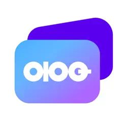
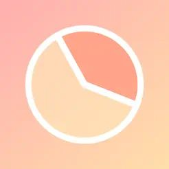

---
vars:
  lang: ko
layout:
  width: default
  title:
    visible: true
  description:
    visible: false
  tableOfContents:
    visible: true
  outline:
    visible: false
  pagination:
    visible: true
  metadata:
    visible: true
---

# 소개


<figure><picture><source srcset=".gitbook/assets/title_dark.png" media="(prefers-color-scheme: dark)"></picture><figcaption></figcaption></figure>



<figure><picture><source srcset=".gitbook/assets/headline_dark.png" media="(prefers-color-scheme: dark)"></picture><figcaption></figcaption></figure>


## 주요 경험


{% column width="66.66666666666666%" %}
### 📦 **모듈화 · 아키텍처 개선으로 확장성과 안정성 확보,** 모듈 이식으로 지원 블록체인 네트워크 <mark style="color:red;">**3배**</mark> 확대.

### 🥇 1인 개발자로 <mark style="color:red;">**앱스토어 생산성 1위**</mark>**,&#x20;**<mark style="color:red;">**15만+ 다운로드**</mark>를 기록한 경험.

### 🎭 제품을 위해 iOS를 넘어 <mark style="color:red;">서버 · React-Native</mark>까지 경험한 엔지니어


{% column width="33.33333333333334%" valign="middle" %}

<figure><figcaption></figcaption></figure>




## 더 알아보기


{% column width="8.333333333333332%" valign="middle" %}

<figure><figcaption></figcaption></figure>



{% column width="41.66666666666667%" valign="middle" %}
[\[Klip\] 지원 네트워크 3배 확대](https://resume.2rick.com/portfolio/klip)


{% column width="8.333333333333337%" %}

<figure><figcaption></figcaption></figure>



{% column width="41.666666666666664%" %}
[\[ABCWallet\] 아키텍쳐 + 모듈화](https://resume.2rick.com/portfolio/abc-wallet)




{% column width="8.333333333333332%" valign="middle" %}

<figure><figcaption></figcaption></figure>



{% column width="41.66666666666667%" valign="middle" %}
[\[하루하루\] 생산성 유료 1위](https://resume.2rick.com/portfolio/haruharu)


{% column width="8.333333333333337%" %}

<figure><figcaption></figcaption></figure>



{% column width="41.666666666666664%" %}
[\[스마트택배\] Obj-C → Swift](https://resume.2rick.com/portfolio/smartparcel)



## 연락하기

✉️ Email: [dev@2rick.com](mailto:dev@2rick.com)

***

<figure><figcaption></figcaption></figure>
