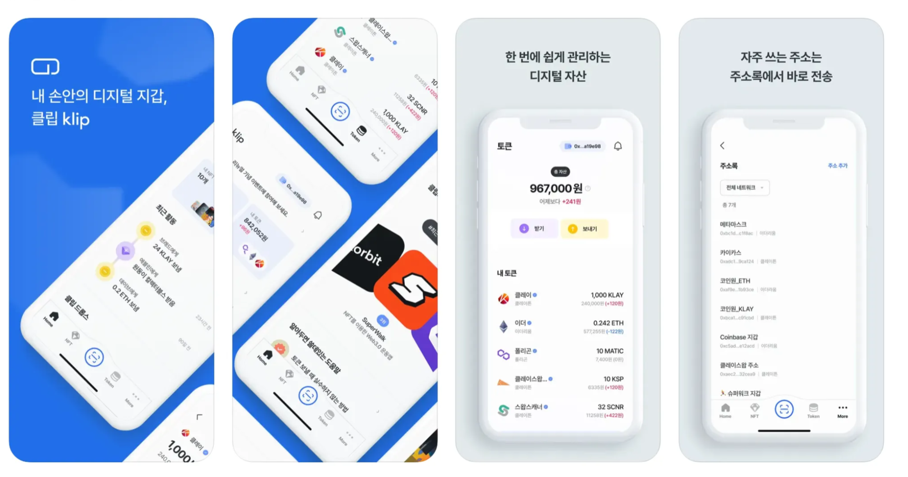
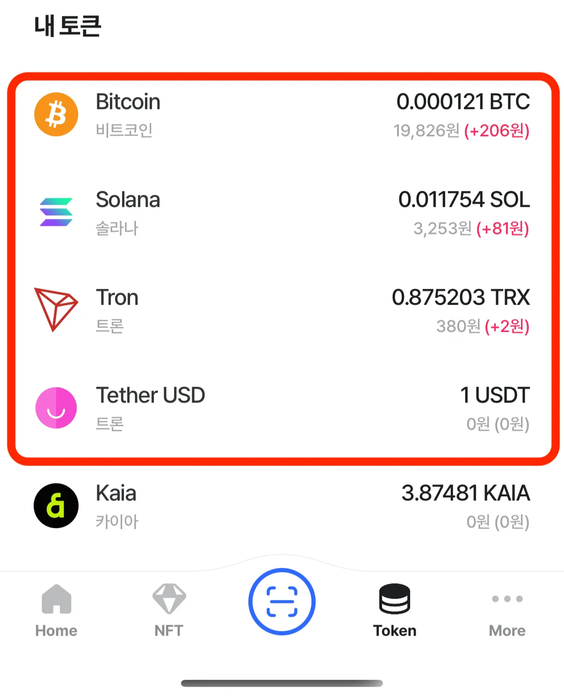

---
layout:
  width: default
  title:
    visible: true
  description:
    visible: false
  tableOfContents:
    visible: true
  outline:
    visible: true
  pagination:
    visible: true
  metadata:
    visible: true
---

# \[Klip] ABC 모듈 성공적으로 적용

<figure><figcaption></figcaption></figure>

***

## **📌 개요**

* **프로젝트 참여 기간**: 2025년 4월 \~ 현재
* **프로젝트 참여 인원**: iOS 개발 2인 / Android 개발 2인
* **역할**: iOS 앱 개발, 멀티체인 (Bitcoin, Solana, Tron, Arbitrum 등…) 지원
* **앱스토어 링크**: [https://apps.apple.com/kr/app/id1627665524](https://apps.apple.com/kr/app/id1627665524)

***

## **🔧 기술 스택 및 아키텍처**

* **아키텍처**: Clean Architecture
* **모듈 관리**: Swift Package Manager
* **기술**: SwiftUI, Swift Concurrency, Combine 등

<figure><figcaption></figcaption></figure>

***

## **🚀 역할내 구현 사례**

### **1. ABCWallet 모듈 이식**

* Domain / Data 영역에 ABCWallet 에서 사용했던 SPM 을 추가적용
* Bitcoin, Solana, Tron 네트워크의 거래를 위한 추가구현

<figure><figcaption>
[모듈 적용]
</figcaption></figure>

<figure><figcaption>
[Solana, Tron 전송 추가구현]
</figcaption></figure>

<figure><figcaption>
[Klip 앱내 신규 블록체인 추가]
</figcaption></figure>

### **2. 자산 및 NFT 전송 추상화**

* 전송 다양한 네트워크 및 암호화 알고리즘에 대해 추상화함
* 그 외에도 수수료(가스비) 계산 / WalletConnect / Receipt Polling 등을 추상화함.

<figure><figcaption>
[Native, FT (ERC-20) 토큰의 거래를 지원]
</figcaption></figure>

<figure><figcaption>
[NFT (ERC-721), MT (ERC-1155) 의 거래를 지원]
</figcaption></figure>

### **3. Klip 프로젝트 스타일의 모듈 추가**

* ABCDomain / ABCData 모듈을 포함하고 기존 Klip에서 사용하고 있던 모듈중 핵심 로직을 Dependency 로 한 Klip 스타일의 새로운 모듈 추가.
* Presentation Layer 에서 실 사용은 ModuleABC 를 사용.

<figure><figcaption></figcaption></figure>

***

## **🎯 성과**

* 기존 4개 → 12 개의 블록체인의 거래를 지원.
* 팀원과의 협업
  * PR 기반 개발 프로세스를 정착시켜 코드 품질을 높이고 커뮤니케이션 효율을 개선.
  * Android 개발팀과 소통을 통해 로직을 교차검증함.
