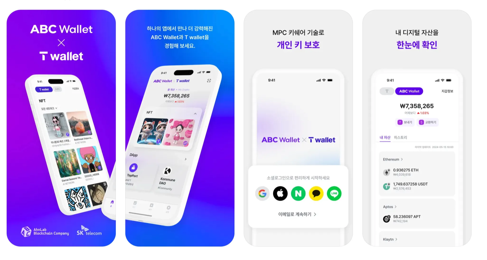
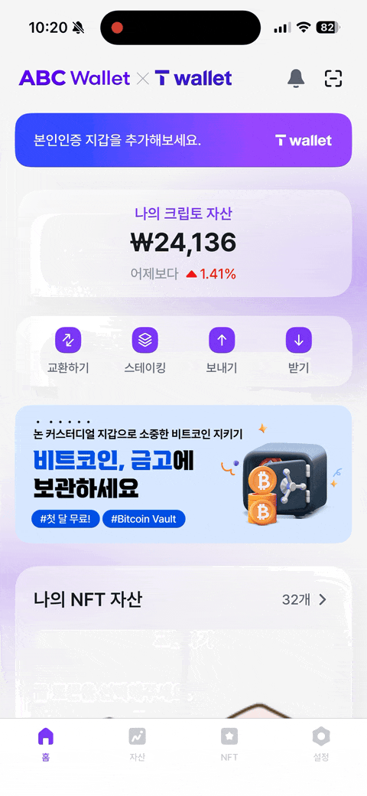

---
layout:
  width: default
  title:
    visible: true
  description:
    visible: false
  tableOfContents:
    visible: true
  outline:
    visible: true
  pagination:
    visible: true
  metadata:
    visible: true
---

# \[ABC Wallet] 설계 / 모듈화

<figure><figcaption></figcaption></figure>

***

## **📌 개요**

* **프로젝트 기간**: 2024년 1월 \~ 2025년 4월 (마지막 업데이트)
* **역할**: iOS 앱 개발, Swap 서버 개발
* **팀 구성**: 기획자 1명, 디자이너 1명, iOS 1명, And 1명, Server 1명, QA 1명
* **출시일**: 2024년 5월
* **앱스토어 링크**: [https://apps.apple.com/kr/app/id1642837445](https://apps.apple.com/kr/app/id1642837445)

***

## **🔧 기술 스택 및 아키텍처**

* **아키텍처**: Clean Architecture + MVVM
* **모듈 관리**: Swift Package Manager
* **기술**: SwiftUI, UIKit, Swift Concurrency, Combine, Storekit 등
* **로컬 데이터**:
  * CoreData – 캐시 데이터
  * UserDefaults – 앱 설정
  * Keychain – MPC 기반 Shared Key

<figure><figcaption></figcaption></figure>

***

## **🚀 주요 기능 및 구현 사례**

### **1. Clean Architecture / SPM 모듈화**

* **Domain** → UseCases, Repository protocol, Entities
* **Data** → Repository Impl, Data Source (Network / Local Storage), Mapper ..
* **ABCUI** → 앱에서 공통적으로 사용하는 View Component 의 집합
* **Common** → Util 기능들의 집합

<div align="left"><figure><figcaption><p>[SPM 모듈화]</p></figcaption></figure></div>

### **2. SNSLoginUseCase 구현 샘플**

이 코드는 **클린 아키텍처의 UseCase 계층**을 구현한 예시입니다.

비즈니스 로직인 _SNS 로그인 처&#xB9AC;_&#xB97C; execute 메서드에 정의하고, 외부 의존성은 모두 추상화된 인터페이스(Repository, Service, UseCase)를 통해 주입받습니다.

* **책임 분리**: 로그인 요청, 사용자 정보 갱신, 토큰 저장, 디바이스 데이터 초기화 등 다양한 책임을 각각의 협력 객체에 위임
* **의존성 주입**: Repository와 Service를 생성자 주입으로 전달받아 테스트 용이성과 유연성 확보
* **비동기 처리**: async/await를 통해 비동기 흐름의 가독성 개선

이 구조는 다른 유즈케이스 구현에도 동일하게 적용되며, **역할별로 분리된 모듈 구조와 유연한 확장성**을 목표로 구성하였습니다.


```swift

public protocol SNSLoginUseCase {
    func execute(with type: ABCUser.LoginType) async throws -> String
}

public final class DefaultSNSLoginUseCase: SNSLoginUseCase {
    
    let authTokenRepository: AuthTokenRepository
    let abcUserRepository: ABCUserRepository
    let clearDeviceStorageUseCase: ClearDeviceStorageUseCase
    private let loginServiceResolver: (ABCUser.LoginType) -> SNSLoginService
    
    public init(
        authTokenRepository: AuthTokenRepository,
        abcUserRepository: ABCUserRepository,
        loginServiceResolver: @escaping (ABCUser.LoginType) -> SNSLoginService,
        clearDeviceStorageUseCase: ClearDeviceStorageUseCase
    ) {
        ...
    }
    
    public func execute(with type: ABCUser.LoginType) async throws -> String {
        guard type != .email else {
            throw SNSLoginUseCaseError.invalidSNSType
        }
        
        let service: SNSLoginService = loginServiceResolver(type)
        
        let idToken = try await service.requestLogin()
        
        let abcToken = try await abcUserRepository.signIn(with: type, idToken: idToken)
        let email = try await abcUserRepository.getEmail(accessToken: abcToken.accessToken)
        
        let cachedUser = abcUserRepository.fetchABCUser()
        
        let abcUser = try await abcUserRepository.updateABCUser(
            accessToken: abcToken.accessToken,
            email: email,
            loginType: type
        )
        if cachedUser?.email != abcUser.email {
            clearDeviceStorageUseCase.execute()
        }
        authTokenRepository.update(abcToken)
        return email
    }
}

```


### 3. ABC Wallet 앱 내 Swap API 개발

* Python, Redis, AWS (ECS)
* 1inch, Swapscanner 의 API 를 활용
* 네트워크(이더리움, 폴리곤, 바이낸스, 카이아 등)에 따라 다른 Provider 를 선택하여 호출

#### 3-1. 구현 한 API 리스트

1. 지원하는 블록체인 리스트 조회
2. 이용 가능한 토큰 리스트 조회
3. 교환 받을 견적 가격 조회
4. ERC20 권한 허용 수량 조회
5. ERC20 권한 허용 Tx Data 조회
6. 교환시 사용할 Tx Data 조회

<div align="left"></div>

### 4.사내 서비스 Waas (Wallet as a service) SDK 설계 및 구현

* Swift 로 iOS 용을 설계 및 구현했고 이를 토대로 Android / Web 용 모듈을 동료들이 구현.
* [Readme WaaS SDK](waas-sdk.md)

***

## **🧠 회고**

### **1. Access Token 관리 로직의 동시성 제어가 가장 어려웠던 부분**

* Access Token을 요청할 때, 유효성 검사를 먼저 수행하고 만료된 경우에는 Refresh 토큰을 통해 재발급 받아야 합니다. 이 과정은 **동시 요청이 겹칠 경우 중복 갱신을 방지하기 위해 단일 스레드에서 순차적으로 처리**되어야 했습니다.
* 초기에는 GCD의 **Serial Queue 를** 활용하여, 토큰 갱신 로직이 하나의 쓰레드에서만 안전하게 실행되도록 처리했습니다.
* 이후에는 **Alamofire의 RequestInterceptor 기능을 사용하면 이러한 흐름을 훨씬 간결하고 안정적으로 구현할 수 있다는 점을 알게 되었고**, 차후 리팩토링에서 해당 방식으로 개선할 계획입니다.

### **2. 클린 아키텍처 적용을 통해 구조적 안정성과 확장성 확보**

* 전체 프로젝트에 Clean Architecture를 적용하여 **도메인, 데이터, 프레젠테이션 레이어를 명확히 분리**하고, 테스트와 유지보수가 용이한 구조를 만들었습니다.
* 프로젝트 초기에는 모듈화를 고려하지 못해 아쉬움이 있었지만, 이후 구조를 개선하며 Klip 앱에 Data / Domain 모듈을 성공적으로 이식하였고, **재사용성과 확장성 면에서 큰 만족감을 느꼈습니다.**
