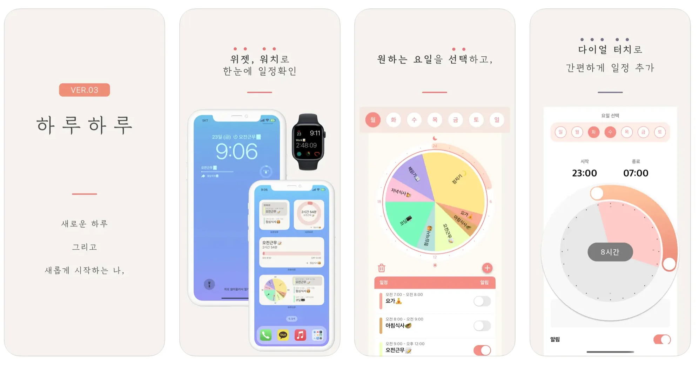

---
layout:
  width: default
  title:
    visible: true
  description:
    visible: false
  tableOfContents:
    visible: true
  outline:
    visible: true
  pagination:
    visible: true
  metadata:
    visible: true
---

# \[하루하루] 앱스토어 2위

<figure><figcaption></figcaption></figure>

***

## **📌 개요**

* **프로젝트 기간**: 2019년 2월 \~ 현재
* **역할**: 기획, 디자인, 개발, 출시 및 운영 전반 (1인 프로젝트)
* **출시 플랫폼**: iOS (iPhone, iPad, Apple Watch)
* **앱스토어 링크**: [https://apps.apple.com/kr/app/id1452035712](https://apps.apple.com/kr/app/id1452035712)
* **피처드**:
  1. [대한민국 App Store 스토리](https://apps.apple.com/kr/story/id1472109186)
  2. [중국 App Store 스토리](https://apps.apple.com/cn/story/id1472109186)

***

## **🧩 프로젝트 소개**

‘하루하루’는 한국 전통의 방학 시간표에서 영감을 받은 **원형 시간표 기반 시간관리 앱**입니다. iPhone, iPad, Apple Watch 전 기기에서 사용할 수 있으며, iCloud를 통한 자동 동기화, 위젯 및 애플워치 컴플리케이션을 통해 **앱을 열지 않고도 일정 확인이 가능한 사용자 경험**을 제공합니다.

SwiftUI, CoreData, CloudKit, WidgetKit, WatchKit 등 iOS의 최신 기술을 적극적으로 활용하여 **개발자 1인이 관리 가능한 범위 내에서 최고의 사용자 경험을 제공하는 것을 목표**로 삼고 있습니다.

***

## **🔧 기술 스택 및 아키텍처**

* **사용 언어**: Swift
* **UI 프레임워크**: SwiftUI + UIKit (혼용)
* **아키텍처**: MVVM + Clean Architecture
* **로컬 / 클라우드 데이터**: CoreData + CloudKit (iCloud 연동)
* **기능 확장**:
  * WidgetKit: 카운트다운 및 시간표 위젯
  * WatchKit + ClockKit: 애플워치 앱 + 컴플리케이션
  * CoreAnimation, CoreGraphics: 커스텀 원형 UI 렌더링
  * StoreKit: 인앱 구매 기반 기능 제한

<figure><figcaption></figcaption></figure>

***

## **🚀 주요 기능 및 구현 사례**

### **1. 원형 시간표 UI**

* CoreGraphics, CoreAnimation 을 이용한 **원형 시계형 시간표 UI 직접 구현**
  * _Widget, Watch Extension 에서의 원형 시간표 UI 는 SwiftUI 를 사용하여 별도로 UI 구현_


```swift
public static func drawSegment(
		withArc arc: Arc,
    lineWidth: CGFloat = 0,
    mode: CGPathDrawingMode = .fillStroke,
    inContext context: CGContext
) {
		let circle = arc.circle
    let origin = circle.origin
        
    UIGraphicsPushContext(context)
    context.beginPath()
        
    context.setLineWidth(lineWidth)
    context.move(to: origin)
    context.addArc(
				center: origin,
        radius: circle.radius,
        startAngle: arc.startAngle,
        endAngle: arc.endAngle,
        clockwise: false
    )
    context.move(to: origin)
    context.drawPath(using: mode)
        
    UIGraphicsPopContext()
}
    
```


<div align="left"><figure><figcaption><p>UIControl 을 활용하여 시간범위입력 Component 구현</p></figcaption></figure> <figure><figcaption><p>Main 화면 View hierarchy</p></figcaption></figure></div>

### **2. 기기의 특성에 맞는 UX 제공**

* **iPhone**: 원형 다이어그램 중심의 단일 뷰 제공 → 집중된 일정 확인
* **iPad**: 리스트 + 원형 다이어그램 동시 제공(Split View) → 탐색성과 가독성 강화
* 기기 특성에 맞춰 **차별화된 UX 설계**

<div align="left"><figure><figcaption><p>iPhone 메인화면</p></figcaption></figure> <figure><figcaption><p>iPad 메인화면 - SplitViewController 를 활용</p></figcaption></figure></div>

### **3. iCloud 동기화 및 다중 기기 대응**

* CoreData + CloudKit 연동을 통해 **모든 기기 간 데이터 자동 동기화** 지원
* 동기화 실패 및 충돌 처리 로직 직접 구현

### **4. 위젯 및 애플워치 대응**

* WidgetKit으로 **시간표 미리보기, 카운트다운** 등 다양한 위젯 구현
* ~~WatchKit + ClockKit을 활용해 Apple Watch 앱 + 컴플리케이션 기능 구현~~
  * Watch Complication 도 WidgetKit 으로 통합하여 구현.

<div align="left"><figure><figcaption><p>iOS App Widget</p></figcaption></figure> <figure><figcaption><p>애플워치 컴플리케이션</p></figcaption></figure></div>

### **5. 프리미엄 기능 잠금 (IAP)**

* 인앱 구매를 통한 기능 잠금/해제
* App Store 영수증 기반 사용자 권한 확인 로직 구현

***

## **🎯 성과**

* **2019 \~ 2024 대한민국 App Store 오늘의 앱 선정**
* **2024 중국 App Store 피처드** 경험
* 유료 앱 카테고리 상위권 유지 (최고 2위)
* 사용자 리뷰 5000건 이상
* 사용자 리뷰 4.6 으로 비교적 높은 평점 유지

***

## **🧠 회고**

* SwiftUI 초기 버전부터 경험하며 생태계 변화에 유연하게 대응
* 개발자로서 지속적인 성장의 원동력이 됨
  * iOS, Swift 의 업데이트와 아키텍쳐 패턴등을 먼저 적용해보고 학습할 수 있는 기회를 제공
* iCloud 연동, WatchKit, 위젯 등 iOS 생태계의 폭넓은 기술을 실전에서 경험
* 단독 개발자로서 운영, 디자인, 사용자 피드백 반영 등 **제품 전체 생애주기를 경험**
