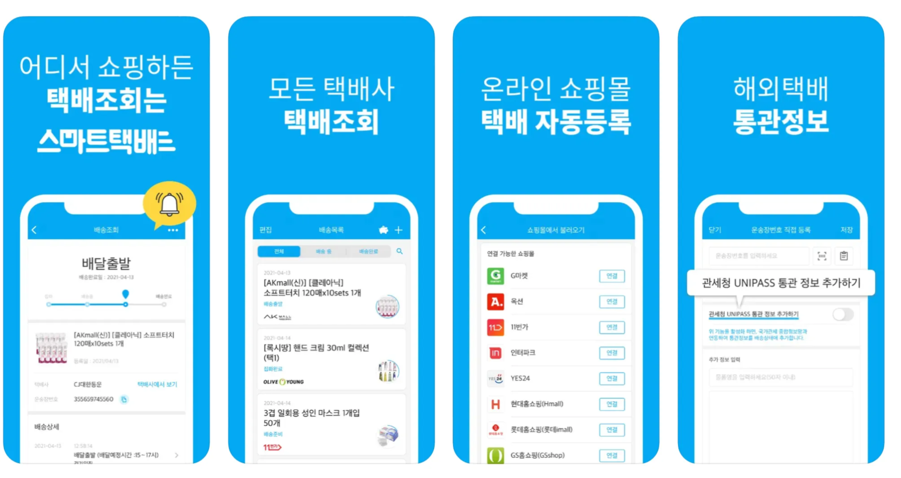

---
layout:
  width: default
  title:
    visible: true
  description:
    visible: false
  tableOfContents:
    visible: true
  outline:
    visible: true
  pagination:
    visible: true
  metadata:
    visible: true
---

# \[스마트택배] Obj-C -> Swift

<figure><figcaption></figcaption></figure>

<table><thead><tr><th width="121">서비스명</th><th>스마트택배 (Smart Parcel)</th></tr></thead><tbody><tr><td>회사명</td><td>스윗트래커 (Sweettracker inc.)</td></tr><tr><td>설명</td><td>스마트택배는 다양한 택배사의 정보를 취합하여 고객에게 배송정보를 전달하는 서비스로, 월간 평균 5000만건의 택배정보를 처리합니다.  iOS 기준 → 30분 동시접속자 3000명 / DAU 5만 / MAU 20만</td></tr><tr><td>플랫폼</td><td>iOS, Android</td></tr><tr><td>참여도</td><td><ol><li>스마트택배의 전체적인 iOS 서비스를 담당</li><li>Objective-C를 Swift로 컨버팅 작업</li></ol><ol start="3"><li>디자인 2.0 개편</li><li>CU택배예약 서비스 신규개발</li></ol></td></tr><tr><td>기간</td><td>2017.08 ~ 2018.06</td></tr><tr><td>사용기술</td><td>Objective-C, Swift, Coredata, AFNetworking, JavaScript</td></tr><tr><td>URL</td><td><a href="https://apps.apple.com/kr/app/%EC%8A%A4%EB%A7%88%ED%8A%B8%ED%83%9D%EB%B0%B0-%EB%AA%A8%EB%93%A0-%ED%83%9D%EB%B0%B0%EC%A1%B0%ED%9A%8C-%EC%87%BC%ED%95%91%EA%B4%80%EB%A6%AC/id523045854">https://apps.apple.com/kr/app/id523045854</a> </td></tr></tbody></table>
